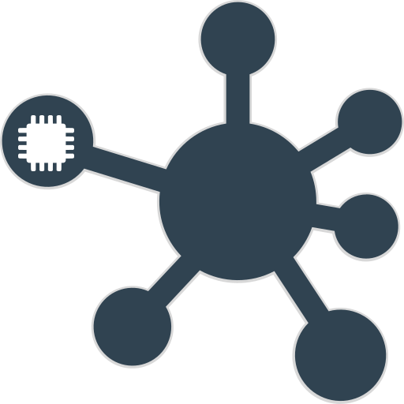
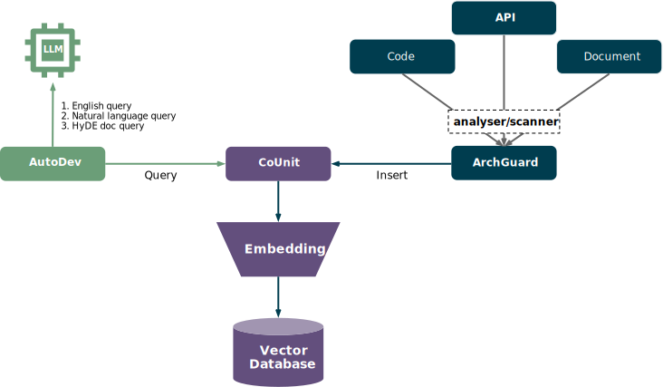

# Co-unit

<p align="center">
  
</p>

> CoUnit，一个基于 LLM 的虚拟团队接口人（API），通过向量化文档、知识库、SDK和 API 等，结合 LLM 智能化团队间对接与协作。

todos:

- Semantic search for Team API
    - [x] ArchGuard API：Code, DatabaseMap, HTTP API
    - [x] Query for OpenAPI
    - [ ] Documents
        - [ ] Markdown
        - [ ] PDF
- Transpile / Translate language
    - [ ] Unique language (aka Domain Language) dictionary
    - [x] Transpile for Code, Datamap, API
- Prompt strategy
    - [ ] [HyDE](https://github.com/texttron/hyde)
    - [x] ~~Jieba.rs + StarDict spike~~
    - [x] Small LLM spike

## Development

Tech stacks:

- Rust, a language empowering everyone to build reliable and efficient software.
- Frameworks:
    - Axum, Ergonomic and modular web framework built with Tokio, Tower, and Hyper
- Infrastructure:
    - Qdrant, Vector similarity search engine
    - Ort, ONNX Runtime is a performance-focused complete scoring engine for Open Neural Network Exchange (ONNX) models.
    - Tokenizers, Fast State-of-the-Art Tokenizers optimized for Research and Production.

Setup:

1. Install Rust
2. Clone this repo: `git clone https://github.com/unit-mesh/co-unit`
3. install Qdrant by Docker:

```bash
docker pull qdrant/qdrant
docker run -p 6333:6333 -p 6334:6334 \
    -e QDRANT__SERVICE__GRPC_PORT="6334" \
    qdrant/qdrant
```

4.Run CoUnit-Server

Join us（Wechat Group: 微信群）:


### API testing

use [counit-server.http](counit-server.http) to test API.

## Integration example with ArchGuard and AutoDev

AutoDev: [https://github.com/unit-mesh/auto-dev](https://github.com/unit-mesh/auto-dev)

ArchGuard: [https://github.com/archguard/archguard](https://github.com/archguard/archguard)

Full processes:



1. Download ArchGuard CLI (scanner_cli-2.0.x-all.jar) from: [https://github.com/archguard/archguard/releases]
2. Run ArchGuard CLI to upload data to Co-Unit:

```bash
Usage: runner [OPTIONS]

  scanner cli

Options:
  --type [SOURCE_CODE|GIT|DIFF_CHANGES|SCA|RULE|ARCHITECTURE|ESTIMATE|OPENAPI]
  --system-id TEXT                 system id
  --server-url TEXT                the base url of the archguard api server
  --workspace TEXT                 the workspace directory
  --path TEXT                      the path of target project
  --output TEXT                    http, csv, json, console
  --output-dir TEXT                output directory
  --analyser-spec TEXT             Override the analysers via json.
  --slot-spec TEXT                 Override the slot via json.
  --language TEXT                  language: Java, Kotlin, TypeScript, CSharp,
                                   Python, Golang.
  --rules TEXT                     rules: webapi, test, sql
  --features TEXT                  features: apicalls, datamap.
  --repo-id TEXT                   repository id used for git analysing
  --branch TEXT                    repository branch
  --started-at INT                 TIMESTAMP, the start date of the scanned
                                   commit
  --since TEXT                     COMMIT ID, the specific revision of the
                                   baseline
  --until TEXT                     COMMIT ID, the specific revision of the
                                   target
  --depth INT                      INTEGER, the max loop depth
  --with-function-code             BOOLEAN, whether to include the function
                                   code
  -h, --help                       Show this message and exit
```

For example:

```bash
java -jar scanner_cli-2.0.6-all.jar --language=Kotlin --path=your_path_to_code --server-url=http://localhost:8765 --repo-id="archguard" --with-function-code --output=http  --features=apicalls
```

OpenAPI example:

```bash
java -jar scanner_cli-2.0.6-all.jar --language=Kotlin --path=your_swagger_3_file --server-url=http://localhost:8765 --repo-id="payment" --output=http --type=OPENAPI 
```

#### ArchGuard APIs:

```http request
### ArchGuard Code datastrcuture
POST http://127.0.0.1:8765/scanner/:systemId/reporting/class-items

### ArchGuard OpenAPI structure
POST http://127.0.0.1:8765/scanner/:systemId/reporting/openapi

### ArchGuard Service Datamap
POST http://127.0.0.1:8765/scanner/:systemId/reporting/container-services

### ArchGuard Datamap 
POST http://127.0.0.1:8765/scanner/:systemId/reporting/datamap-relations
```

## License

The Co-Unit index is licensed under the Apache 2.0 license based
on [https://github.com/BloopAI/bloop](https://github.com/BloopAI/bloop) . See `LICENSE`
in [counit-index](./counit-index).

This code is distributed under the MPL 2.0 license. See `LICENSE` in this directory.
